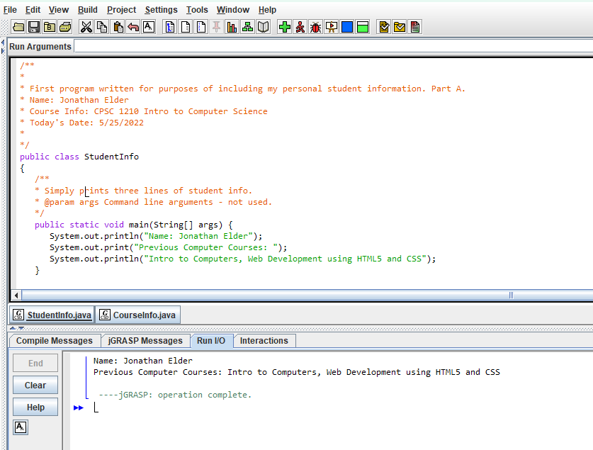
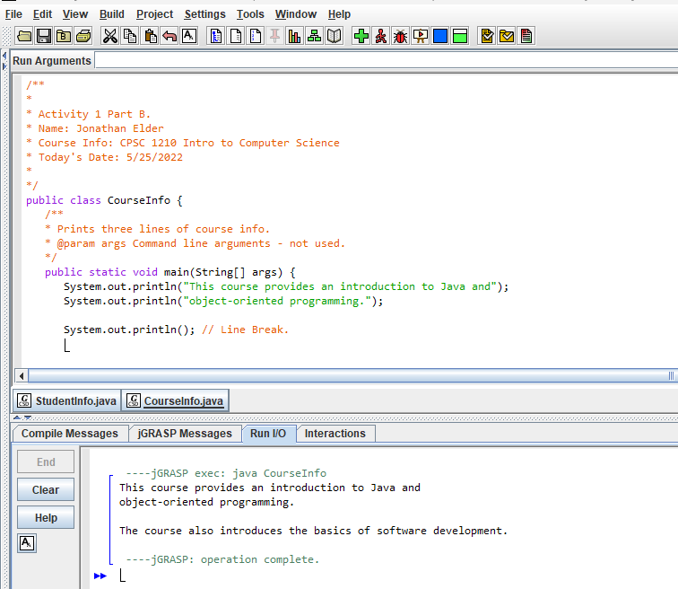
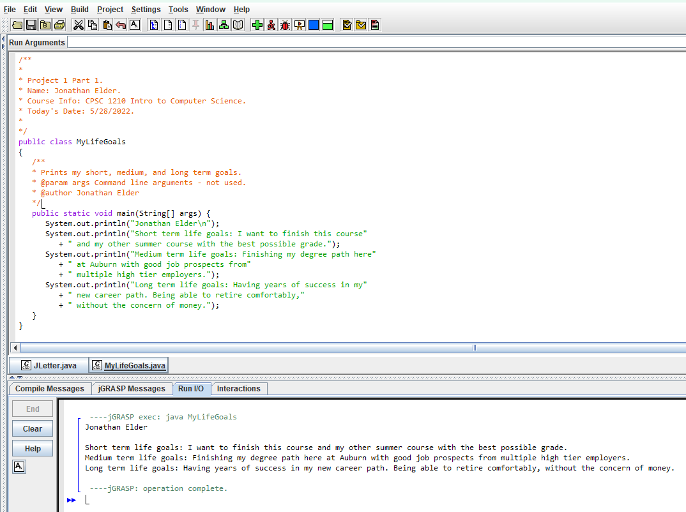
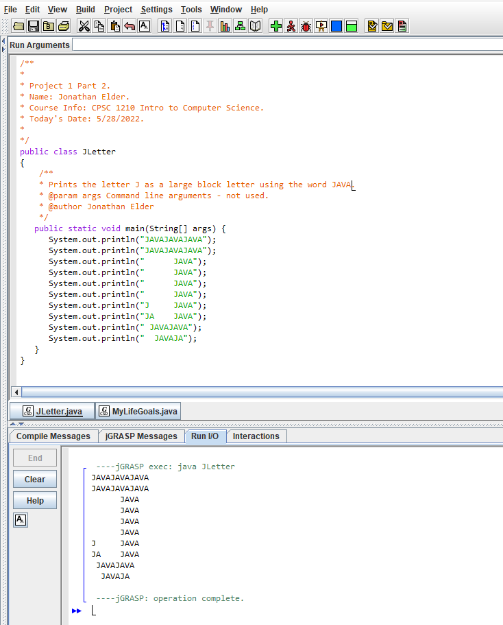

# Module 1 – CPSC 1210: Intro to Computer Science I

This module contains the first set of programming activities and projects completed for **CPSC 1210 - Intro to Computer Science I**. Each section below includes a screenshot demonstrating successful execution of the corresponding program.

> 📍 **IDE Used:** All programs were developed and run using [jGRASP](https://jgrasp.org/), a lightweight development environment that provides simple visualization for Java and other programming languages. It is ideal for beginner-level programming courses due to its clear interface and easy debugging features.

---

## 📸 Activity 1 – Part A

---

## 📸 Activity 1 – Part B

---

## 📸 Project 1 – Part 1

---

## 📸 Project 1 – Part 2

---

## 💬 Notes

- This module helped reinforce basic programming concepts such as input/output, variables, and control structures.
- Programs were compiled and executed using **jGRASP**, which also provided syntax highlighting and error feedback useful for debugging early-stage code.
- File naming followed a consistent convention to stay organized as the course progresses.
- Screenshots were taken immediately after program execution to show correct functionality and console output.
- Each activity was an opportunity to build comfort with writing Java code independently and interpreting compiler messages.
