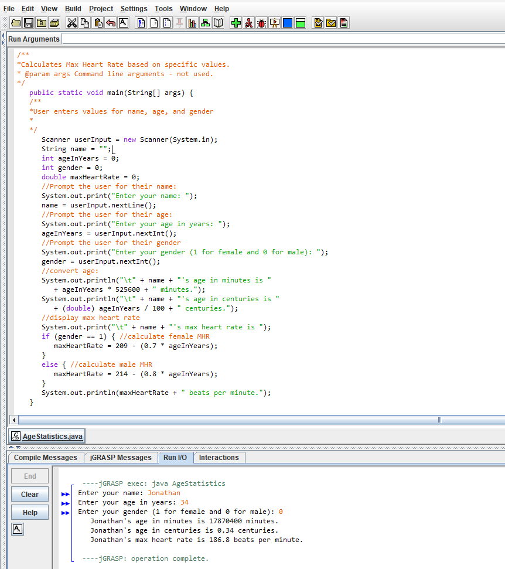
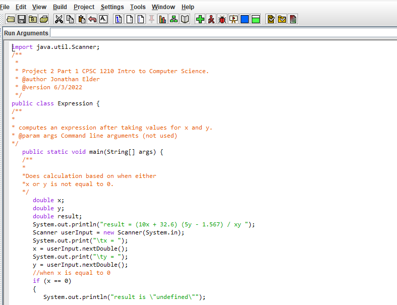
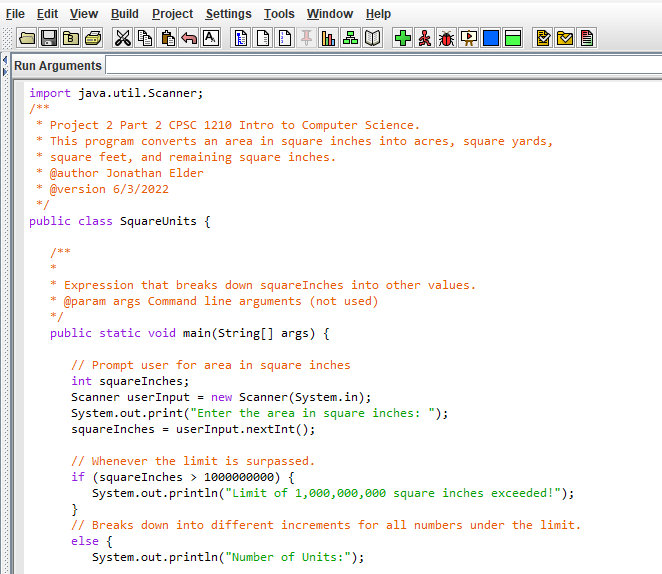

# Module 2 – CPSC 1210: Intro to Computer Science I

This folder contains the activities and projects I completed for **CPSC 1210 - Intro to Computer Science I**. Each screenshot demonstrates a successful execution of the corresponding activity or project for the module.

> **IDE Used:** All programs were developed and run using [jGRASP](https://jgrasp.org/), a lightweight development environment that provides simple visualization for Java and other programming languages. It is ideal for beginner-level programming courses due to its clear interface and easy debugging features.

---

## 📸 Activity 2 

---

## 📸 Project 2 – Part 1

(Photos/Project2_part1_2.png)

---

## 📸 Project 2 – Part 2

(Photos/Project2_part2_2.png)
(Photos/Project2_part2_3.png)

---

## 💬 Notes

- Programs were compiled and executed using **jGRASP**, which also provided syntax highlighting and error feedback useful for debugging early-stage code.
- File naming follows a consistent convention to stay organized as the course progresses.
- Screenshots were taken immediately after program execution to show correct functionality and console output.
- Each activity was an opportunity to build comfort with writing Java code independently and interpreting compiler messages.
