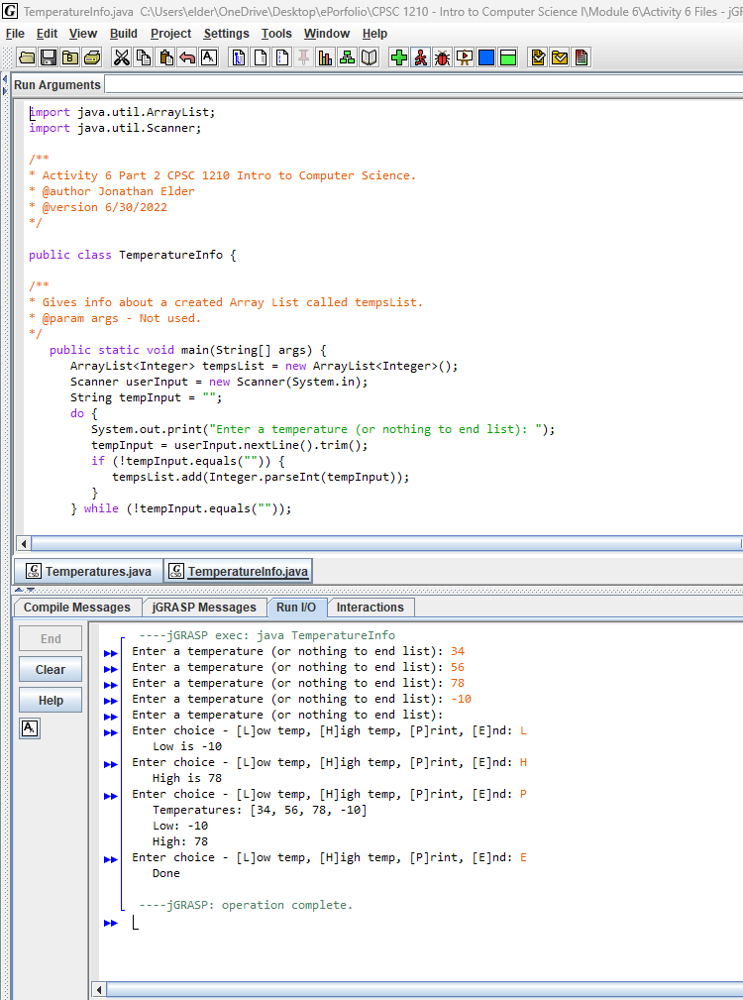
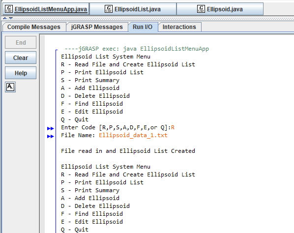
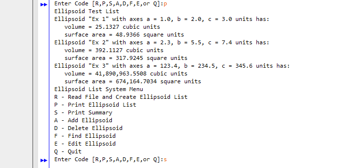
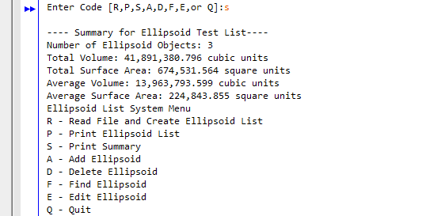
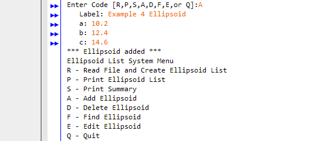
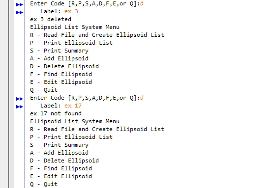
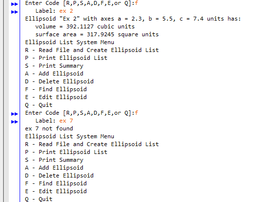
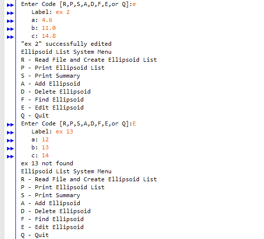
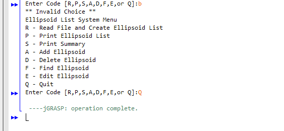

# Module 6 – CPSC 1210: Intro to Computer Science I

This folder contains the activities and projects I completed for Module 6 within **CPSC 1210 - Intro to Computer Science I**. Each screenshot demonstrates a successful execution of the corresponding activity or project for the module.

> **IDE Used:** All programs were developed and run using [jGRASP](https://jgrasp.org/). It is ideal for beginner-level programming courses due to its clear interface and easy debugging features.

---

## 📸 Activity 6

---

## 📸 Project 6

**The result of the user selecting ‘p’ to Print Ellipsoid List is shown below.**

**The result of the user selecting ‘s’ to print the summary for the list is shown below.**

**The result of the user selecting ‘a’ to add an Ellipsoid object is shown below.**

**Here is an example of the successful “delete” for an Ellipsoid object.**

**Here is an example of the successful “find” for an Ellipsoid object.**

**Here is an example of the successful “edit” for an Ellipsoid object.**

****

**Below is an example of entering an invalid code, followed by an example of entering a ‘q’ to quit the application.**

---

## 💬 Notes

- Programs were compiled and executed using **jGRASP**, which also provided syntax highlighting and error feedback useful for debugging early-stage code.
- Screenshots were taken immediately after program execution to show correct functionality and console output.
- Each activity was an opportunity to build comfort with writing Java code independently and interpreting compiler messages.
